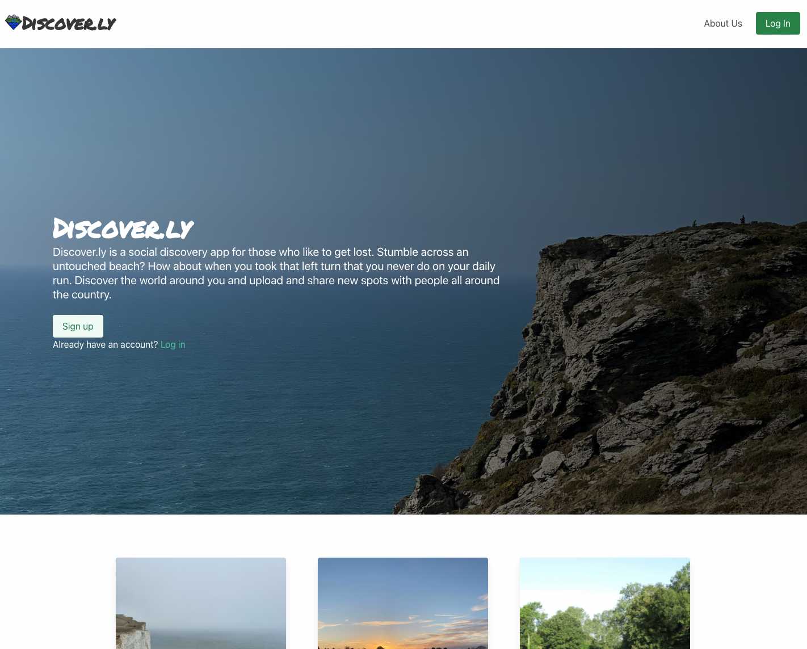
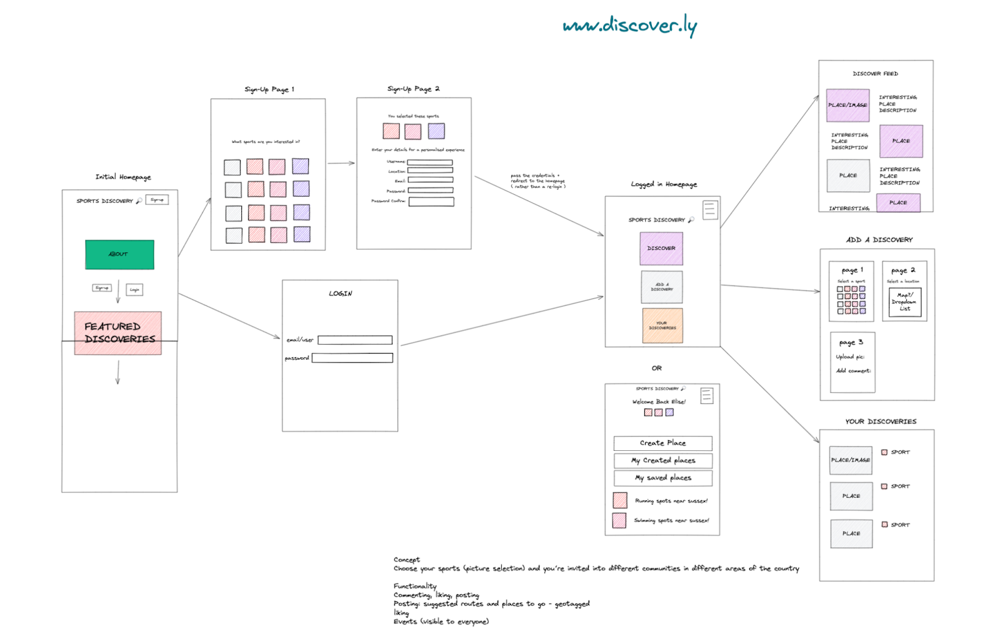
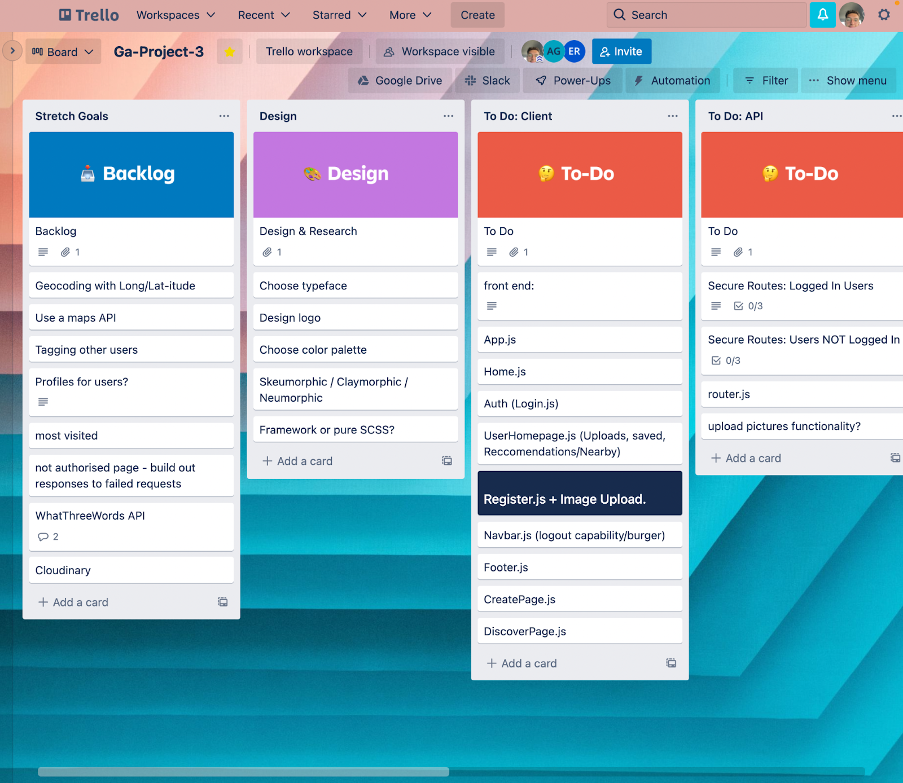

<div id="top"></div>

# Discover.ly - GA Project 3



<!-- TABLE OF CONTENTS -->
<details>
  <summary>Table of Contents</summary>
  <ol>
    <li>
      <a href="#overview">Overview</a>
      <ul>
        <li><a href="#built-with">Built With</a></li>
      </ul>
    </li>
    <li><a href="#installation">Installation</a></li>
    <li><a href="#the-brief">The Brief</a></li>
    <li><a href="#approach">Approach</a></li>
    <li><a href="#wins">Wins</a></li>
    <li><a href="#future-improvements">Future Improvements</a></li>
    <li><a href="#key-learnings">Key Learnings</a></li>
  </ol>
</details>

<!-- OVERVIEW -->
## Overview
_Discover.ly_ is an app built using the MERN stack where users can discover and share outdoor spots. 

* **Team members:** [Ashley Gyngell](https://github.com/ashleygyngell), [Tom Riley](https://github.com/TomCRiley) and [Elise La Rooy](https://github.com/eliselarooy) 
* **Duration:** 7 days 

### Built With
* HTML 
* SCSS/Bulma 
* JavaScript
* MongoDB
* Express
* React
* Node.js

This repo contains code for the backend only. The code for the frontend is [here](https://github.com/eliselarooy/discover.ly_client).

<!-- INSTALLATION -->
## Installation
The app is deployed on Netlify and available here &rarr; https://discoverly.netlify.app/ \
[](https://app.netlify.com/sites/discoverly/deploys)

Feel free to register your own account, or you can use email `elise@email.com` and password `password!1`.

To run the project locally:
1. Make sure you have a local version of MongoDB running 
2. Frontend: 
    - Clone the [frontend](https://github.com/eliselarooy/discover.ly_client) repo
    - Run `npm install` to install npm packages
    - Run `npm run start:client` and open http://localhost:8001 in the browser
3. Backend: 
    - Clone this repo
    - Run `npm install` to install npm packages
    - Run `npm run seed` to populate the database with seed data
    - Run `npm run start:server`

<!-- THE BRIEF -->
## The Brief
Build a full-stack application using MongoDB, Express, React and Node.js.

<!-- APPROACH -->
## Approach
### Planning
We started out by discussing our ideas for the project and discovered our shared love of the outdoors which led us to build an app to share our favourite places. We designed our wireframes and agreed upon an MVP and stretch goals. This gave us a clear plan to follow.



We used Trello to break the project down into ‘tickets’ which we kept updated throughout the project. 



We set up the initial code on GitHub and worked out the best way to use Git branches for collaborative working. Every morning, we had a standup to keep each other updated on our progress and discuss any blockers. 

### Functionality
We started by building out the backend using MongoDB and Mongoose and each took ownership of an area to write the models, controllers and routes. I did Users and authentication whilst Tom and Ash worked on Spots and Comments.

As discussed at the beginning of the project, we wanted to focus on usability. In line with this, I altered the login function to take either an email or username: 

```javascript
const user =
  (await User.findOne({ email: req.body.email })) ||
  (await User.findOne({ username: req.body.email }));

if (!user) {
  return res.status(203).send({ message: 'User not found' });
}
```

Next, I worked on creating the functionality for ‘likes’ which would later be used on the frontend allowing users to like or unlike spots and view their liked spots. This involved updating the User model to store an array of ObjectIds that reference documents from the Spot model. 

```javascript
const addLike = async (req, res, next) => {
  try {
    const spot = await Spot.findById(req.params.id);

    if (!spot) {
      return res.status(404).send({ message: 'Spot not found' });
    }

    if (spot.likedBy.includes(req.currentUser._id)) {
      return res.status(203).send({ message: 'User has already liked this' });
    }

    spot.likedBy.push(req.currentUser._id);

    const data = await spot.save();

    await User.updateMany(
      { _id: spot.likedBy },
      { $push: { likedSpots: spot._id } }
    );

    return res.status(201).json({ message: 'Added like', data });
  } catch (err) {
    next(err);
  }
};
```

With enough backend functionality to meet our MVP, we moved on to the frontend. To make the registering and login process smooth and robust, we ensured that: 
- The login and register forms were easy to find 
- When a user registers, they are automatically logged and redirected to their profile page 
- Useful error messages were generated and displayed on the frontend 

With registering and login complete, I used conditional rendering to update the navbar depending on the logged-in state, displaying either ‘Sign up’ and ‘Log in’ when logged out or ‘Log out’, ‘Profile’ and ‘Add new spot’ after logging in. 

I also created a ‘Discover’ page which lists all posts made by users. This became a little unwieldy to scroll through when the number of posts increased so I added a text index with a wildcard specifier to the Spot model and created a search endpoint. This takes a keyword input from the user which is sent via query params to the API and returns all spots with matching text in any string field. 

```javascript
const searchSpots = async (req, res, next) => {
  const searchText = req.query.text;
  searchText.replace(' ', '%20');

  try {
    if (searchText === '') {
      const results = await Spot.find({});
      res.status(200).json(results);
    } else {
      const results = await Spot.find({ $text: { $search: searchText } });
      res.status(200).json(results);
    }
  } catch (err) {
    next(err);
  }
};
```

As an additional feature, I added the ability for logged in users to comment on and rate posts. This gave me further opportunity to use conditional rendering as all users can view comments but only logged-in users are able to add a comment, and a user can only delete their own comments. I simplified the comments display by moving it to a separate ‘Comment’ component which also allowed me to easily grab the usernames to display. 

```javascript
<section className="container my-4">
  {spot.comments.map((comment) => (
    <Comment
      key={comment._id}
      {...comment}
      onClick={() => {
        handleDeleteComment(comment._id);
      }}
    />
  ))}
</section>
```

On the final day, we worked through a few minor bugs and improved the styling then populated the database with seed data for Users and Spots, randomly allocating Users to the created by field on the Spots data. 

```javascript
// Creating users
const users = await User.create(usersData);
console.log('Users added to database:', users);

spotsData.map(
  (spot) =>
    (spot.createdBy = users[Math.floor(Math.random() * users.length)]._id)
);

// Creating spots
const spots = await Spot.create(spotsData);
console.log('Spots added to database:', spots);
```

<!-- WINS -->
## Wins
As a team, we spent time creating a comprehensive plan using tools such as a Trello board. This was key to the completion of our project as it enabled us to focus our time more precisely and build the app incrementally to achieve all of our goals.

In our stretch goals, we wanted to add complex features to give extra functionality to the end-user. We managed to integrate features such as likes, maps, photo uploads, comments and animations. These features give the app a complete feel and a seamless design.

<!-- FUTURE IMPROVEMENTS -->
## Future Improvements 
- Allow liking spots from the main ‘Discover’ page and improve clarity by displaying an ‘empty’ heart if the user has not liked the spot and a ‘filled’ heart once liked 
- Ordering the spots on the ‘Discover’ page by the most recently posted 
- Add the ability for users to edit their profile page and add a bio

<!-- KEY LEARNINGS -->
## Key Learnings 
We were really pleased with how the project turned out and I believe this was due to how well we worked as a team. It was a fantastic experience and a great opportunity to work collaboratively and maintain a shared codebase. 

<p align="right">(<a href="#top">back to top</a>)</p>
